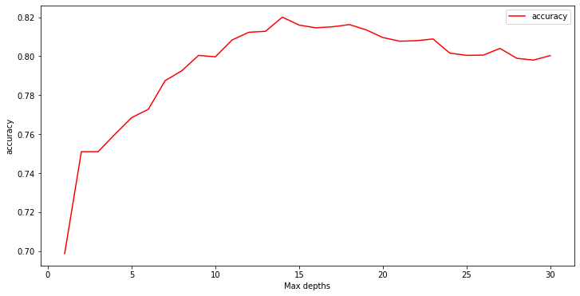
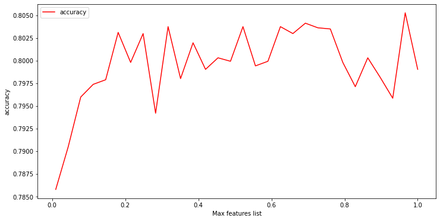
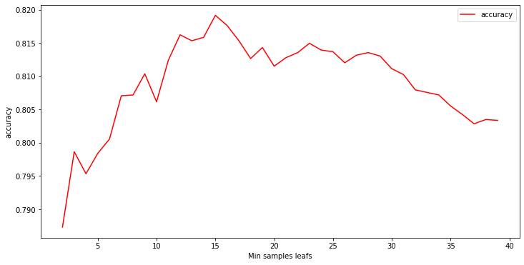
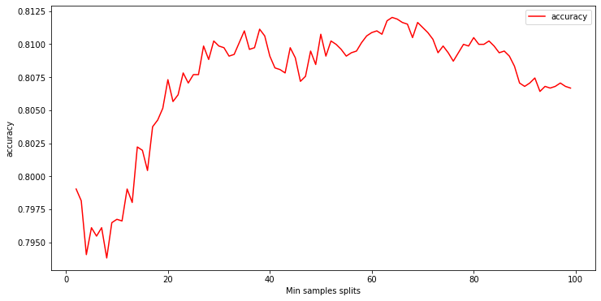
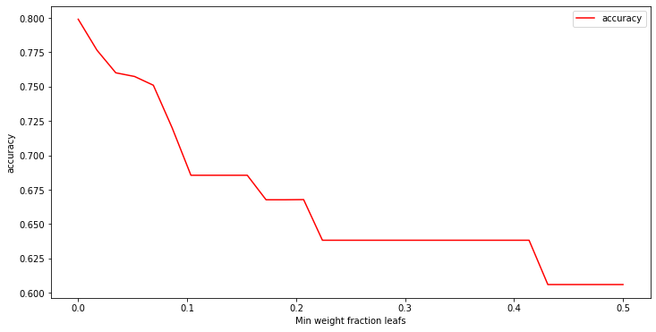
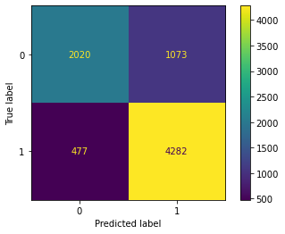

# Tanzanian Water Problems

## Overview

Through DrivenData.org I have been tasked to predict whether or not a water point in Tanzania will need repairs. I am to use data telling me about location, what type of pump is being used and how its being managed in order to predict if it needs repairs or not. I use a Decision Tree Classifier that has been tuned to this data. I end up with more false positives than I would like as that means my model predicted the water point doesn't need repair, when in fact it does. This means more Tanzanians will go without water than I want.

## Business Problem

Tanzania has issues providing clean water to its population of over 57,000,000. Through a competition on DrivenData.org I have been tasked to analyze and predict which water pumps will need to be repaired in the future. Understanding what water pumps will need repairs can improve maintenace costs and time, and ensure the availability of clean water to Tanzanians.

## Data

The data I am using was sourced from Taarfia and The Tanzanian Ministry of Water. Given that this data is from a competition I know that it perfectly relates to the business problem. The data gives information about the location of the water point, what type of pump is being used, how its being managed and when it was installed. Using this information I need to predict whether a pump is functional, needs some repairs or doesn't work at all.

## Methods

First to analyze I dove into looking through all the value counts for my variables. Looking to figure out which columns I was going to use. What I was looking for was medium variety, high null value count, checking for null replacement values etc. This was a ternary classification problem however I converted it to a binary classification problem to save on time. After cleaning I decided to go with a simple GridSearchCV Decision Tree Classifier. I did a simple model instead of a more complicated one because I want to know which variables are affecting my model the most. My main step was hyperparameter tuning of which the results for accuracy can be found below.





I used these results to find a starting point for my Grid Search to build my final model. 

## Results

I ended with an accuracy score of 0.8026 so I can confidently say that this model would help with improving maintenace costs and time, and ensure the availability of clean water to Tanzanians. The most important variables for my model ended up being quantity of water, what type of extraction, what year it was built and the location. Due to me not going deeper and changing the problem back to ternary we ended up with a lot more false postitves then false negatives. As seen below from my confusion matrix.



## Conclusions

The Tanzanian Ministry of Water can use this model to predict which water point will need repairs or not. The next step to make this model better predict for the Tanzanian Ministry of Water would be to train the model to be stricter when predicting that the water point is working.

## For More Information

Please review my full analysis in [my Jupyter Notebook](./Notebooks/FinalProduct.ipynb) or our [presentation](./TanzanianWaterPresentation.pdf).
Additonal Notebooks: 
[Exploration](./Notebooks/MaidenVoyage.ipynb)
[Hyperparameter Tuning](./Notebooks/Hyperparameter_tuning.ipynb)
For any additional questions, please contact Ethan Helder at helderethan@gmail.com

## Repository Structure

```
├── README.md                           <- The top-level README for reviewers of this project
├── FinalProduct.ipynb   <- Narrative documentation of analysis in Jupyter notebook
├── TanzanianWaterPresentation.pdf         <- PDF version of project presentation
├── Data                                <- Both sourced externally and generated from code
└── Images                              <- Generated from code